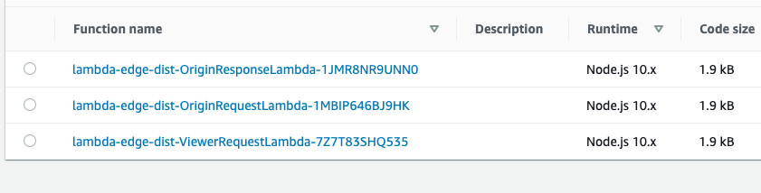
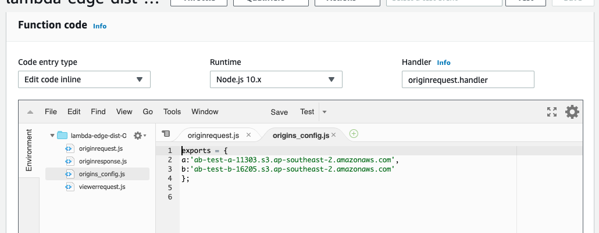
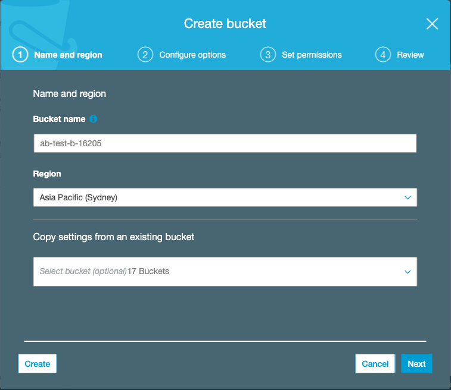
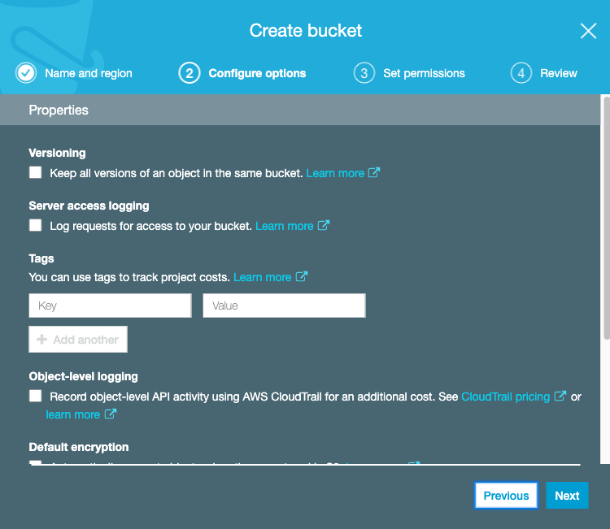
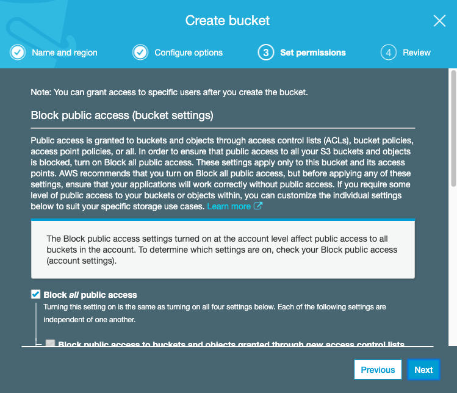
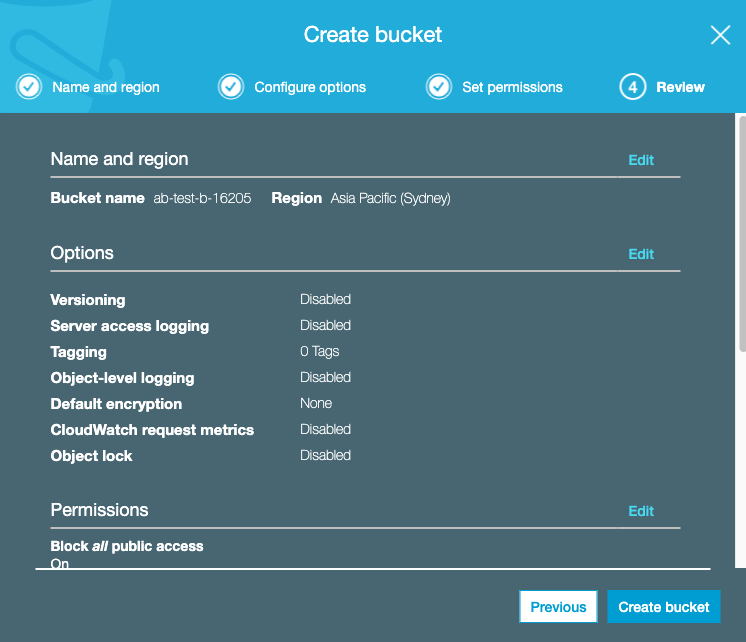
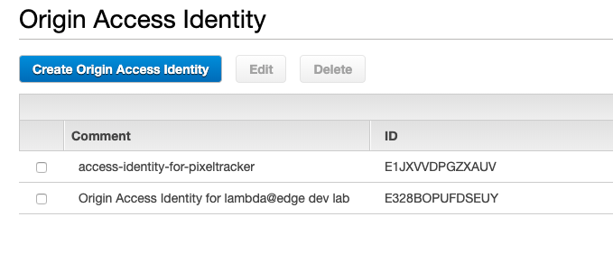

# A/B testing with lambda@edge

In this lab we will learn how we can use lambda@edge functions to serve different variants of the same static resources from a CloudFront distribution.

This ability can be used to enable A/B testing of staticly deployed websites without resorting to complex and resource intensive conditional server-side rendering of content.

Headings with the &#9432; symbol indicate Information only sections of this README

Those with the &#9755; symbol indicate action to be taken to complete the lab


## &#9432; How do lambda@edge functions work?


lambda@edge functions can be triggered by 4 different CloudFront events that correspond to the following stages of a Cloudfront content request:  


  -   After CloudFront receives a request from a viewer (viewer request)
  -   Before CloudFront forwards the request to the origin (origin request)
  -   After CloudFront receives the response from the origin (origin response)
  -   Before CloudFront forwards the response to the viewer (viewer response)


## &#9432; What are we building?

The lab starts with an already deployed Cloudfront distribution that has 3 lambda@edge functions associated with it: a [Viewer Request function](#viewer-request-function), an [Origin Request function](#origin-request-function) and an [Origin Response function](#origin-response-function). The CloudFront distribution is set to forward `pool` cookies to the Origin - meaning that the `pool` cookie is part of the cache key. This allows us to utilise the caching abilities of CloudFront so that subsequent requests that include a `pool` cookie, will fetch the same content from the edge cache without hitting the Origin


This allows us to:
1. Randomly split traffic into two groups or pools
2. Serve two different variants of content from either of two origin S3 buckets (the `A` or `B` bucket)
3. Ensure that subsequent requests from the same clients will be served the same content that they first received (session stickyness)

### &#9432; Viewer request function:

This function intercepts the viewer request before it is routed to the Cloudfront cache. The code simply adds a `pool` cookie, value: `pool=a` or `pool=b` to the request header if one is not already present. Users without an existing pool cookie are randomly assigned either `pool=a` or `pool=b` with an equal probability (50/50) of being assigned either.

  - [edge-functions/src/viewerrequest.js](edge-functions/src/viewerrequest.js)


### &#9432; Origin Request function:

This function changes the origin bucket location in the request to point to either origin `A` or origin `B` depending on the value of the `pool` cookie.

  - [edge-functions/src/originrequest.js](edge-functions/src/originrequest.js)


### &#9432; Origin Response function:

Adds a `Set-Cookie` header to set the `pool` cookie to match the origin from where the content was served - ensuring that clients that made a requests without a `pool` cookie are instructed to store and send the pool cookie value that matches the origin for subsequent requests.

  - [edge-functions/src/originresponse.js](edge-functions/src/originresponse.js)

---


### Deploy Bucket A and Bucket B content origins

Currently the OriginRequest lambda@edge function associated with our CloudFront distribution have been configured to change the request origin to either of two origin buckets. In order to complete the lab you will have to create and configure these origin buckets.

#### &#9755; Discover the origin buckets: 

To find out which S3 buckets the Cloudfront distribution has been configured to use as the A and B origin, examine the source code for the lambda@edge functions:

In the console, Switch to us-east-1 region, Select Lambda service.

You should see three lambda functions listed, with names starting with the prefix: `lambda-edge-dist-`:
IE:



Select the Origin Response function and scroll down to the inline code editor where you will be able to look at the source code for the deployed functions:

The origin configuration can be found in the shared `origin_config.js` file 

The origin config file will look something like this:



These are the fully qualified S3 domain names for the two origin buckets we need to create.

IE:
```javascript
exports = {
  a:'ab-test-a-11303',
  b:'ab-test-b-16205'
};
```

NB. The names of your origin buckets will differ slightly from those shown above.

#### &#9755; Create the origin buckets:

Create origins A & B:

1. In the AWS Console, navigate to the S3 service: Select the Services drop down in the top left of the screen and select Storage > S3 or search for S3

2. Click the Create Bucket button and create the `a` bucket: 
   - Bucket name :`ab-test-a-[XXXX]` and region: `Asia Pacific (Sydney)` - replace `[XXXX]` so that it matches the name of the bucket in the origin_config.js
   
   - Accept the default options for the following screens:
   
   
   

3. Repeat the above steps to create the `b` bucket


#### &#9755; Grant CloudFront permission to read from the origin buckets

In order to grant our CloudFront distribution permission to read from our origin buckets we need to use a special identity called an [Origin Access Identity](https://docs.aws.amazon.com/AmazonCloudFront/latest/DeveloperGuide/private-content-restricting-access-to-s3.html).

The CloudFront distribution that has been set up for this lab has already been associated with an Origin Access Identity. All that is left for us to do is to assign a BucketPolicy to each that explicity allows read access (Action : S3.GetObject) to that Origin Access Identity and therefore to our distribution. 

1. Find the Origin Access Identity ID:
   - Navigate to the CloudFront Services dashboard
   - Select `Origin access identity` on the right hand side of the screen:
   - 
   - Note the ID of the origin access identity with the description: `Origin Access Identity for lambda@edge dev lab`

2. Add a Bucket Policy to both of the origin buckets:
   - For each bucket created above, 
   - Navigate to : Permissions > Bucket Policy:
   - copy and paste the following Bucket Policy statement, but do not save it yet:
   ```json
   {
       "Version": "2008-10-17",
       "Id": "PolicyForCloudFrontPrivateContentA",
       "Statement": [
           {
               "Sid": "1",
               "Effect": "Allow",
               "Principal": {
                  "AWS": "arn:aws:iam::cloudfront:user/CloudFront Origin Access Identity E328BOPUFDSEUY"
               },
               "Action": "s3:GetObject",
               "Resource": "arn:aws:s3:::ab-test-a-11303/*"
           }
       ]
   }
   ```
   - Before saving, replace the string `E328BOPUFDSEUY` in the above with the ID of the OAI you just discovered and also ensure the resource arn matches that of the bucket


Alternatively, using the CLI + Cloudformation/SAM to create the origin buckets & their bucket policies:

1. Query Cloudformation to find the Origin Access Identity that was created in the set-up of the Cloudfront Distribution to retrieve it's canonical user ID (a 63 character string):

```bash
aws cloudformation describe-stacks --stack-name lambda-edge-dist --region us-east-1 --query 'Stacks[0].Outputs[?OutputKey==`OaiS3CanonicalUserId`].OutputValue[]' --output text
```

2. Using the canonical user ID as well as the names of the origin buckets, as parameter overrides, deploy the origin stack:

```bash
sam deploy --template-file ./content/origin-template.yml --tags "purpose=lab project=lambda-edge-ab" --parameter-overrides "OriginAccessIdentity=[[OAI]] OriginA=[[ORIGIN_A]] OriginB=[[ORIGIN_B]]"
```

Where:

 - `[[OAI]]` is the value of the canonical user id you fetched previously 
 - `[[ORIGIN_A]]` is the name of the origin A bucket - ie: `ab-test-a-11303`
 - `[[ORIGIN_B]]` is the name of the origin B bucket 


---


### Upload content 

In the content folder of this solution you will see two subfolders: `origin-a` and `origin-b` with two different versions of a single web-page

```
content/
├── origin-a
│   └── index.html
└── origin-b
    └── index.html
```

Upload these to the corresponding origin buckets:

Either:

#### &#9755; using the console

1. S3, select origin A bucket, upload the content/origin-a/index.html and content/origin-a/favicon.ico
2. S3, select origin B bucket, upload the content/origin-a/index.html and content/origin-b/favicon.ico


or: 

#### &#9755; using the CLI

```bash
aws s3api put-object --bucket [[ORIGIN_A]] --content-type text/html --cache-control max-age=60 --key index.html --body ./content/origin-a/index.html
aws s3api put-object --bucket [[ORIGIN_A]] --content-type image/vnd.microsoft.icon --cache-control max-age=60 --key favicon.ico --body ./content/origin-a/favicon.ico
aws s3api put-object --bucket [[ORIGIN_B]] --content-type text/html --cache-control max-age=60 --key index.html --body ./content/origin-b/index.html
aws s3api put-object --bucket [[ORIGIN_B]] --content-type image/vnd.microsoft.icon --cache-control max-age=60 --key favicon.ico --body ./content/origin-b/favicon.ico
```

Replace `[[ORIGIN_A]]` and `[[ORIGIN_B]]` with the names of the `origin-a` and `origin-b` 

---

## Testing

1. When the cloudfront distribution was created it was assigned an automatically generated domain name - to find out what it is, navigate to the CloudFront service dashboard in the AWS console 
    
2. You will see a CloudFront distribution with the comment : "AB testing Cloudfront distribution".
3. Copy and paste the domain name for this distribution into your browser
4. You will see either of these two pages:

    

    

5. If you open the dev tools (in Chrome: it's under View > Developer Tools > Developer Tools) and examine the Cookies (Chrome Developer Tools > Application tab, Storage : Cookies) you will see that your browser will now have a `pool` session cookie for the current domain, the value of which will match the Origin that the content was served from:

    

6. Open the Network tab in the developer tools and ensure that the __Preserve log__ checkbox is checked, then refresh the page any number of times. You will see the same content with each page refresh - the `pool` session cookie ensures that your request will be served content from the same origin. If you examine the response headers while you do this (Chrome: Developer Tools : Network tab) you will see a couple of things:
   - The initial response will have a `200` (OK) status code and a custom `X-Cache` header with a value: `Miss from cloudfront` - this is a hint from cloudfront that tells us that this content was fetched directly from the origin, and not served from the cloudfront cache. The matching request will have no `Cookie: pool=[[X]]` header, but the server will add a `Set-Cookie: pool=[[X]]` header to the response - this instructs your browser to create the pool cookie and append it to subsequent requests to the same domain.
   - Subsequent requests will have the `Cookie: pool=[[X]]` header and may have a `304` (Not Modified) status code along with an `X-Cache: Hit from cloudfront` header and an `Age` header - this type of response means a couple of things:
      - [304 - not modified](https://developer.mozilla.org/en-US/docs/Web/HTTP/Status/304). The server (cloudfront) has recognised that the content being requested has not changed since the client last received a valid copy - this is mediated by the `If-Modified-Since` and `If-None-Match` request headers sent by the client. When your browser receieves the `304` response it actually serves the page content from it's internal cache rather than the full content from the server - this is the purpose of 304 responses, they do not contain a message-body for this reason
      - `X-Cache: Hit from cloudfront` - cloudfront has checked the request against it's edge cache - and not the origin. 
      - The `Age` response header tells us how old the cached copy of the content is in seconds. By default this distribution is configured to only keep a copy of the content in it's cache for 30 seconds - the default cache lifetime can be overridden by adding a `max-age` cache-control header to the content in the S3 origin.
        
7. Change the value of the `pool` cookie to the other origin (if it is currently `a`, change it to `b`) and then refresh the page. You will now see the alternate content for the same resource.
8. Delete the `pool` cookie and refresh the browser, you have a 50/50 chance of seeing the alternate content.
9. Another way to see how the cloudfront distribution segments the request pool you can use the command line tool `curl` without cookie support and only display headers:
    ```bash
    curl [[cloudfront distribution url]] -I
    ```

    ie:

    ```bash
    $ curl https://d1zgmfxdzld6c1.cloudfront.net/ -I
    HTTP/1.1 200 OK
    Content-Type: text/html
    Content-Length: 265
    Connection: keep-alive
    x-amz-id-2: /zGPn/NhYYNIOchCmZiHK/lZrAAW0romq31kcpEkRebJ6ZUWqUd+pyTKzscL4i6kpVucUumNgZw=
    x-amz-request-id: 68E4BAF29529C48B
    Date: Tue, 03 Mar 2020 01:04:57 GMT
    Last-Modified: Mon, 02 Mar 2020 23:28:58 GMT
    ETag: "eb917878863c53e7524d411549dfabb2"
    Accept-Ranges: bytes
    Server: AmazonS3
    Set-Cookie: pool=b
    X-Cache: Hit from cloudfront
    Via: 1.1 3396f08538cae17d7cab5e402e844a55.cloudfront.net (CloudFront)
    X-Amz-Cf-Pop: HIO50-C2
    X-Amz-Cf-Id: D7eaOlHsp-dtCte_-t4s8BM3peEpJ-OYGtdo2BfBL4TQ7-o3UzYRnQ==
    Age: 12 

    $ curl https://d1zgmfxdzld6c1.cloudfront.net/ -I
    HTTP/1.1 200 OK
    Content-Type: text/html
    Content-Length: 266
    Connection: keep-alive
    x-amz-id-2: DWwGbd8+lki8CRRAott/bUbZIUE5U1Dq6KC+ETYX+z98vRYQFEPLLfVVuHQdfCEFetCppx2Sh08=
    x-amz-request-id: 80649D41C2C7E7AF
    Date: Tue, 03 Mar 2020 01:04:47 GMT
    Last-Modified: Mon, 02 Mar 2020 23:36:49 GMT
    ETag: "52558a791313aeada9ed5dd201714d92"
    Accept-Ranges: bytes
    Server: AmazonS3
    Set-Cookie: pool=a
    X-Cache: Hit from cloudfront
    Via: 1.1 8acea2e792e5adae36bc6e11fb7a3b02.cloudfront.net (CloudFront)
    X-Amz-Cf-Pop: HIO50-C2
    X-Amz-Cf-Id: wr25xRK9qgt0D0dNwOVPksAfFDt1KhGf0Fy-vwSuiGn4AKkXAZvldg==
    Age: 24
    ```


